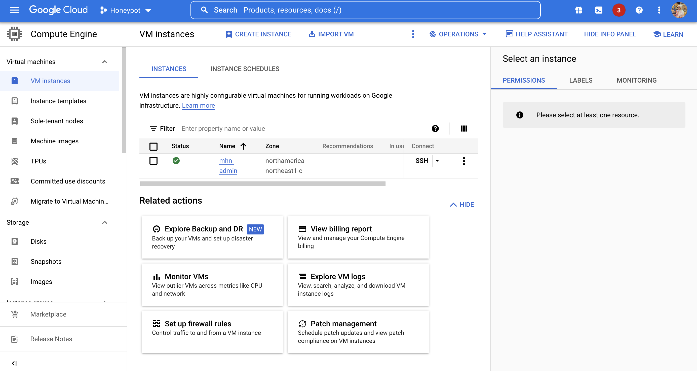
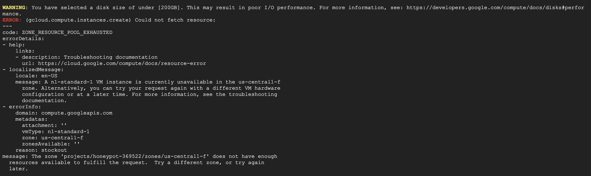

# Honeypot Assignment

**Time spent:** **18** hours spent in total

**Objective:** Create a honeynet using MHN-Admin. Present your findings as if you were requested to give a brief report of the current state of Internet security. Assume that your audience is a current employer who is questioning why the company should allocate anymore resources to the IT security team.

### MHN-Admin Deployment (Required)

**Summary:** How did you deploy it? Did you use GCP, AWS, Azure, Vagrant, VirtualBox, etc.?   
I tryed deploying mhn-admin using Google Cloud Platforms (GCP) but I was unable to sucessfully create the MHN-Admin VM because I recieved an error when selecting region saying there is not enough resources to fulfill my request. Update - I changed the region to northamerica-northeast1-c and it created the MHN-Admin VM, however when I try to load the page does it takes a while after I type it into my browser and press enter. 

### Dionaea Honeypot Deployment (Required)

**Summary:** Briefly in your own words, what does dionaea do?  
Dionaea is used to capture attack payloads and malware. It uses Python for scripting, libemu to detect shellcodes and supports IPV6 and TLS. Dionaea traps malware from Server Message Block (SMB), Hypertext Transfer Protocol (HTTP), File Transfer Protocol (FTP), Trivial File Transfer Protocol (TFTP), Microsoft SQL Server (MSSQL), and Voice over IP (VoIP). 

### Database Backup (Required) 

**Summary:** What is the RDBMS that MHN-Admin uses? What information does the exported JSON file record?   
MHN-Admin uses a single admin VM which is used to deploy, manage and collect information from the honeypots, which are deployed as separate VMs. The JSON file should have the data collected from your honeypots. Unfortunately, due to the errors I was facing, I was unable to do this step.

*Be sure to upload session.json directly to this GitHub repo/branch in order to get full credit.*

## Notes

Describe any challenges encountered while doing the assignment.  

There were a lot of challenges I faced with this Honeypot assignment due to the fact that the instructions is outdated. I had a lot of issues in the beginning with setting up Google Cloud Platform and navigrating to the Compute Engine to create VMs. When I overcame that challenge I started facing issues with creating VM through the gcloud console and even with the UI itself. The issue that took the longest to overcome was finding a region that can create my VMs. 

