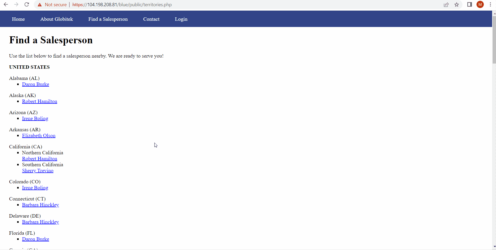
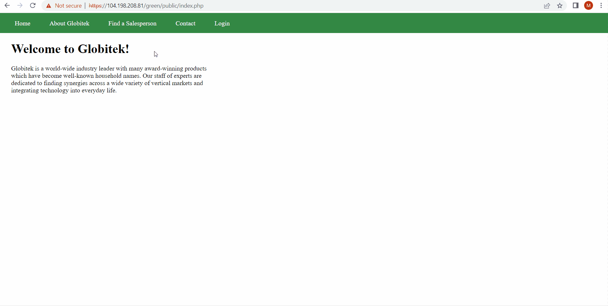
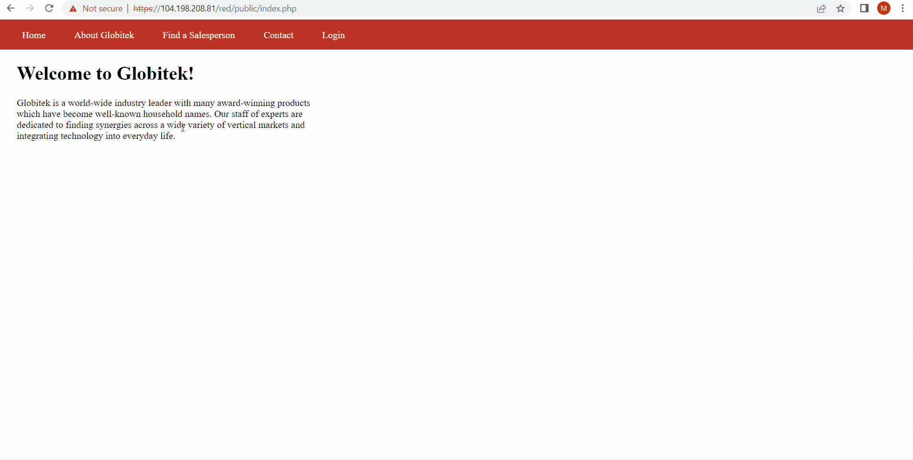

# Pen Testing Live Targets

Time spent: **X** hours spent in total

> Objective: Identify vulnerabilities in three different versions of the Globitek website: blue, green, and red.

The six possible exploits are:

* Username Enumeration
* Insecure Direct Object Reference (IDOR)
* SQL Injection (SQLi)
* Cross-Site Scripting (XSS)
* Cross-Site Request Forgery (CSRF)
* Session Hijacking/Fixation

Each color is vulnerable to only 2 of the 6 possible exploits. First discover which color has the specific vulnerability, then write a short description of how to exploit it, and finally demonstrate it using screenshots compiled into a GIF.

## Blue

**Vulnerability #1: SQL Injection**  
Most of the data input received by these websites is being sanitized properly. However, one of the three sites has one place where the input is not being sanitized before being used in an SQL query. Determine which color has the vulnerability.

**_Description:_** The developer did not properly sanitize salesperson.php query. The database is vulnerable to SQLi attacks becuase if we add an SQL command instead of the proper saleperson's ID number which causes the database to wait  for 5 seconds before displaying, "database query failed".

## Green

**Vulnerability #1: User Enumeration**  
A careless developer mistake has created a username enumeration vulnerability. Determine which color has the vulnerability. You can use the existing username "jmonroe99" as a test. Next, figure out what mistake the developer made.

**_Description:_** When an existing user attempts to login with a wrong password, there is an error message displayed in bold. However if the username does not exist, and the user enters a password, the error messgae is unbold. The developer created a vulnerability by forgetting to keep span tags class the same when a username is found versus not found. 

## Red

**Vulnerability #1: Insecure Direct Object Reference**  
One of the three sites is missing code which would prevent some sensitive information from being made public. Determine which color has the vulnerability. Then, figure out what the other two sites did correctly to prevent the information leak

**_Description:_** We are able to view confidential information about speicifc salespersons by modifying the ID parameter in the URL. We can access illegal ID's 10 and 11. The developer forgot to check if object reference request is made public or not in the red site. The blue and green sites have prevented this IDOR attack by redirecting users to the orginal "Find a Salesman" page. 

## Notes

No challenges
